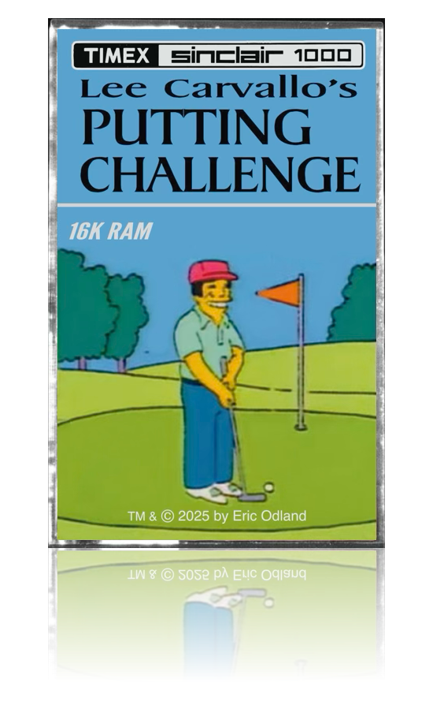
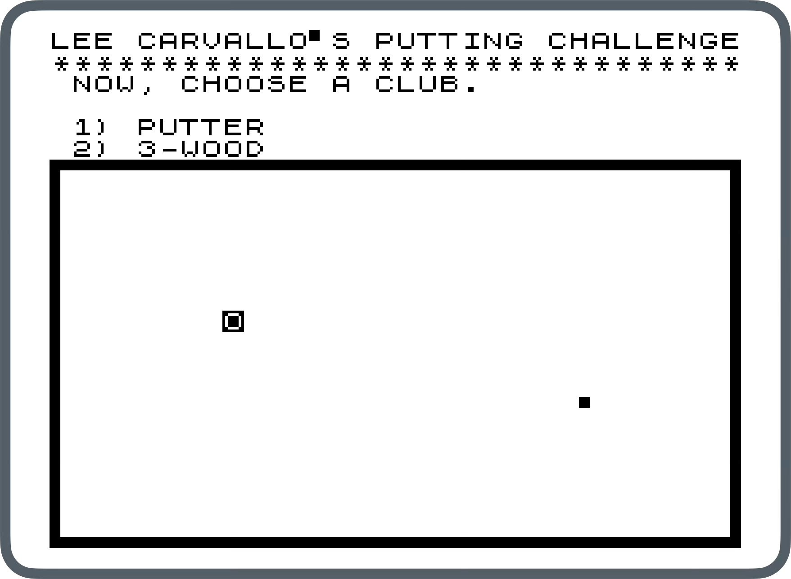
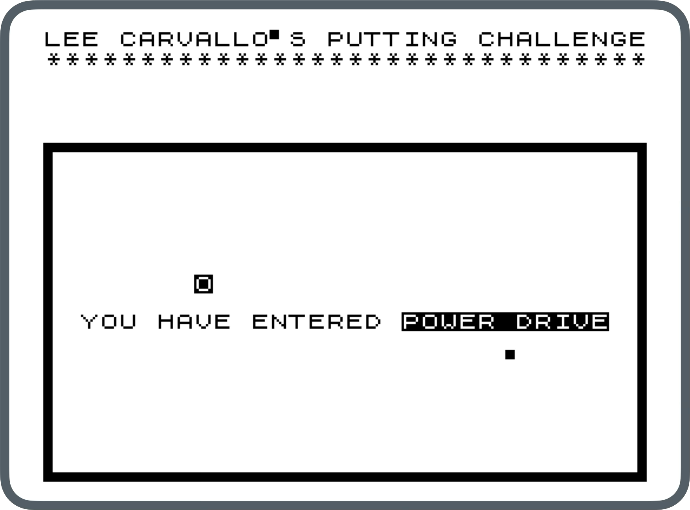
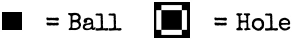

#  Lee Carvallo's Putting Challenge

[](./images/lee-tape.png)

A golf game For ZX81 / Timex Sinclair 1000 computers with 16K RAM expansion
pack, originally created for the
[Vintage Computer Festival West](https://vcfed.org/events/vintage-computer-festival-west/)
in Mountain View, CA in 2025.

Inspired by Lee Carvallo's Putting Challenge from The Simpsons.


## Game features

- Fully playable putting game (5 holes total)
- Option of two clubs: putter, 3-wood
- POWER DRIVE option
- Authentic winner certificate printout (requires printer connection such as
  [ZX printer](https://en.wikipedia.org/wiki/ZX_Printer))
- Score-keeping (no manual score card or pencil necessary)

## How to play

[](./images/lee-screenshot-1.png)
[](./images/lee-screenshot-2.png)

<hr>

[](./images/ball-hole.png)

1. Choose a club (we suggest a putter)
2. Choose a direction (0.0 - 12.0 like the hours on a clock, decimals okay)
3. Enter the force of your swing (a number from 1 through 9, where 1 represents
   “feather touch” and 9 is “power drive”)
4. Beat all 5 holes and you win!

## Running

### Emulation

Use a ZX81 emulator like [ZEsarUX](https://github.com/chernandezba/zesarux) to
run `lee-carvallo.P`.

For example, on MacOS:

```bash
/Applications/zesarux.app/Contents/MacOS/zesarux_cmd.sh \
  --printerbitmapfile "$(pwd)/printout.txt" \
  "$(pwd)/lee-carvallo.P"
```

Note the `--printerbitmapfile` option is only needed if you want to simulate
printing.

### Real hardware

You can record `lee-carvallo.wav` onto a cassette tape recorder to play on a
real ZX81 / Timex Sinclair 1000.

#### Requirements

- **ZX81 / Timex Sinclair 1000** with a **16K RAM expansion pack**
- **Cassette tape deck** with record/play capability
- Computer with **1/8" (3.5mm) audio output** + **audio cable**

#### Record program to tape

1. Connect computer headphone jack to cassette input
2. Insert cassette and rewind to beginning
3. Set cassette deck to:
   - Record level: peak between +0 and +3 dB
   - Noise reduction: OFF
   - Tape bias: I or II (depending on tape)
4. Start recording on tape
5. Play audio file at 0dB volume
6. Monitor recording levels with VU meter
7. Wait for playback to complete and stop the tape

#### Load program from tape

1. Connect cassette deck output to ZX81 EAR socket
2. Turn on the ZX81 with 16K RAM expansion pack
3. Rewind tape to beginning
4. Type `LOAD ""`, start playback on tape, and press Enter
5. The screen will flash, indicating the program is loading (up to about ~4-5
   minutes)
6. The program starts automatically once loading is complete

## Build from source

### Prerequisites

- [z88dk](https://www.z88dk.org/) - Z80 development kit

### Steps

1. Install prerequisites if you haven't already (see above)
2. Clone the repository:

   ```bash
   git clone https://github.com/de-mux/lee-carvallos-putting-challenge.git
   cd lee-carvallos-putting-challenge
   ```

3. Compile the game:

   ```bash
   make
   ```

This will generate two files:

- `lee-carvallo.P` - the main executable.
- `lee-carvallo.wav` - a wave file that can be copied to a cassette tape to load
  on a real ZX81.

### Optional compiler defines

- `NOPRINTOUT` - By default, winners get a certificate printout with their name
  on it, which assumes a printer is connected. Add `-DNOPRINTOUT` to disable
  printing.

```bash
make CFLAGS+=-DNOPRINTOUT
```

## License

[BSD 3-Clause License](./LICENSE)
